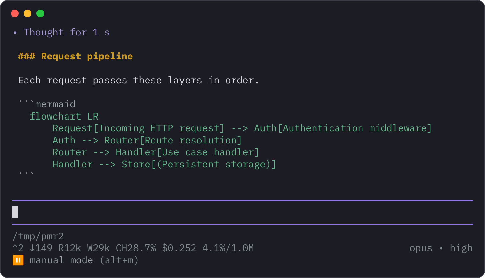
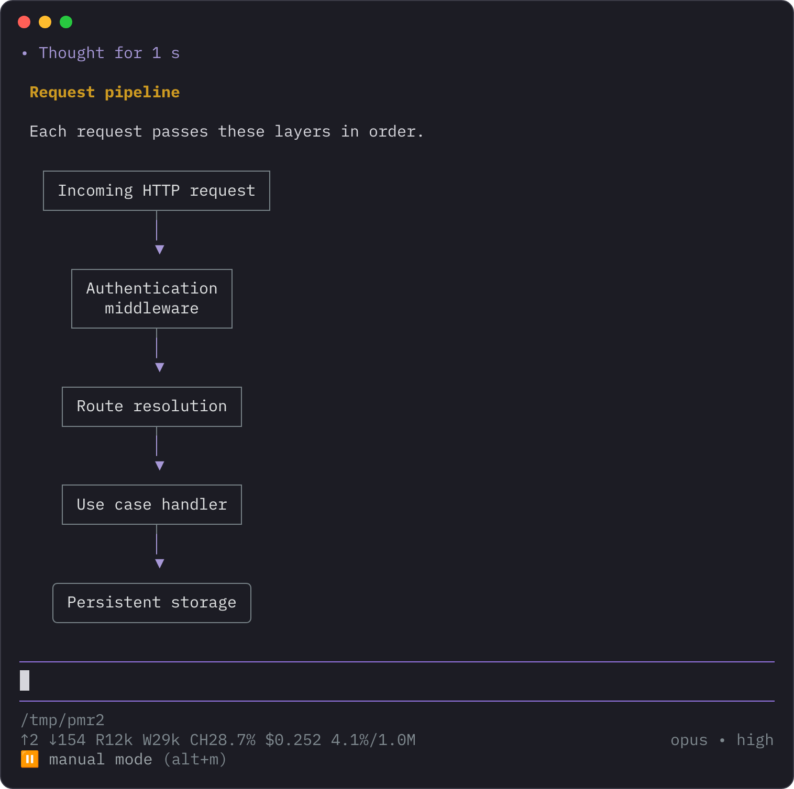
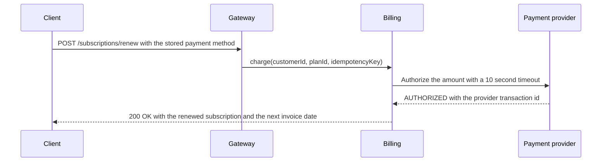
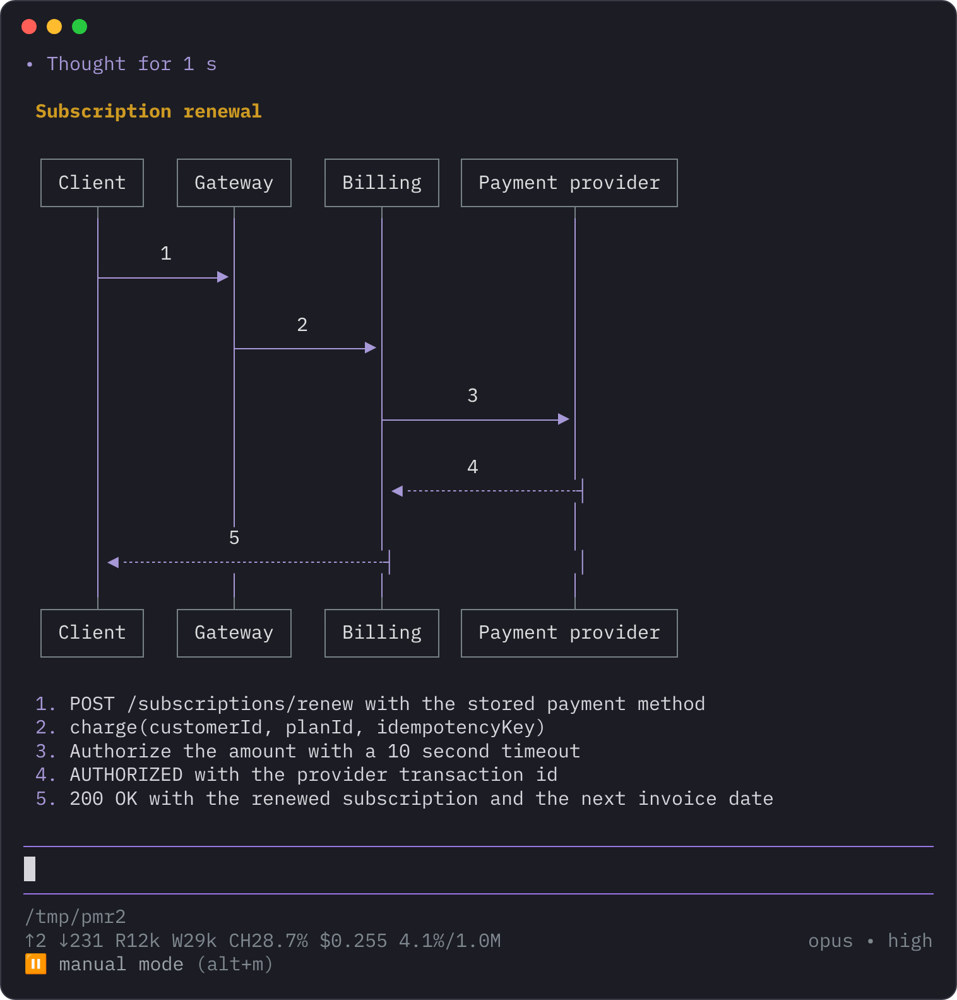
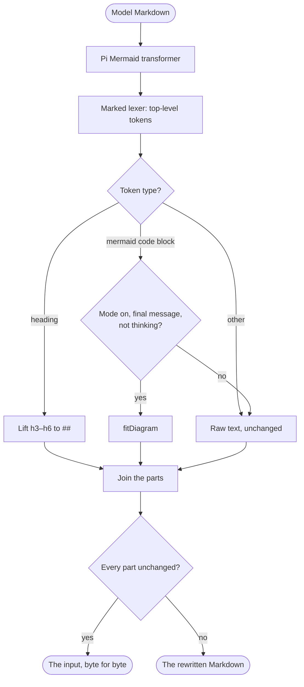
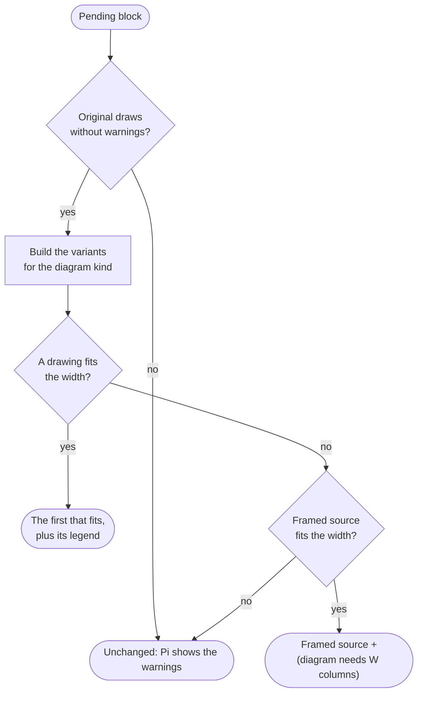
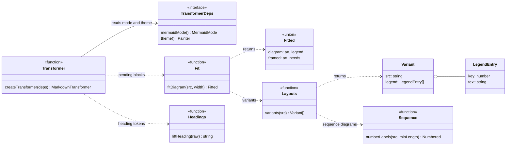

```text
 ⠀⠀⠀⠀⠀⠀⠀⠀⠀⠀⠀⠀⠀⠀⠀⠀⠀⠀⠀⠀⠀⠀⠀⠀⠀⠀⠀⠀⠀⠀⠀⠀⠀⠀⠀⠀⠀⠀⠀⠀⠀⠀⠀⠀⠀⠀⠀⠀⠀⠀⠀⠀⠀⠀⠀⠀⠀⠀⠀⠀⠀⠀⠀⢀⡀⡠⡠⡢⡠⡀
 Markdown answers that fit the terminal.⠀⠀⠀⠀⠀⠀⠀⠀⠀⠀⠀⠀⠀⠀⠀⠀⠀⠀⠀⠀⠀⠀⢀⠔⣠⣞⡶⣕⡮⣪⡌⠄
 ⠀⠀⠀⠀⠀⠀⠀⠀⠀⠀⠀⠀⠀⠀⠀⠀⠀⠀⠀⠀⠀⠀⠀⠀⠀⠀⠀⠀⠀⠀⠀⠀⠀⠀⠀⠀⠀⠀⠀⠀⠀⠀⠀⠀⠀⠀⠀⠀⠀⠀⠀⠀⠀⠀⠀⠀⠀⠀⠀⠀⠀⢰⢜⢾⡷⣟⡷⡯⡿⡮⢕⡀
 ⚠ Status: 0.1.0. Pins grok-mermaid 0.2.3 and Pi 0.99.2.⠀⠀⠀⠀⠀⠀⠀⠀⠀⠀⠀⠀⠀⠀⠀⠀⠀⠀⡀⠋⣓⢯⡛⢊⠛⢉⢿⡘⢢⠀⡀
 ⠀⠀⠀⠀⠀⠀⠀⠀⠀⠀⠀⠀⠀⠀⠀⠀⠀⠀⠀⠀⠀⠀⠀⠀⠀⠀⠀⠀⠀⠀⠀⠀⠀⠀⠀⠀⠀⠀⠀⠀⠀⠀⠀⠀⠀⠀⠀⠀⠀⠀⠀⠀⠀⠀⠀⠀⠀⠀⡠⡄⣎⣧⢐⢜⣟⣿⢦⣴⣿⣙⢢⠣⢠⠆
 h3–h6 headings without # marks.⠀⠀⠀⠀⠀⠀⠀⠀⠀⠀⠀⠀⠀⠀⠀⠀⠀⠀⠀⠀⠀⠀⠀⠀⢀⢠⢮⣚⢮⠓⠋⢱⠙⢌⢘⠍⡗⠕⡘⠜⣔⡇⠅
 ⠀⠀⠀⠀⠀⠀⠀⠀⠀⠀⠀⠀⠀⠀⠀⠀⠀⠀⠀⠀⠀⠀⠀⠀⠀⠀⠀⠀⠀⠀⠀⠀⠀⠀⠀⠀⠀⠀⠀⠀⠀⠀⠀⠀⠀⠀⠀⠀⠀⠀⠀⠀⠀⠀⡠⠏⡊⢿⣧⣅⠁⢀⠈⢤⡡⣆⢎⢆⢕⠠⠁⠹⢪⠨
 Wide Mermaid diagrams, redrawn to fit.⠀⠀⠀⠀⠀⠀⠀⠀⠀⠀⠀⠀⠀⠀⠀⠀⠀⢳⢰⠡⠘⣯⣿⠀⠤⣴⡮⡪⢎⢎⠪⡈⠄⠀⠅⡠
 ⠀⠀⠀⠀⠀⠀⠀⠀⠀⠀⠀⠀⠀⠀⠀⠀⠀⠀⠀⠀⠀⠀⠀⠀⠀⠀⠀⠀⠀⠀⠀⠀⠀⠀⠀⠀⠀⠀⠀⠀⠀⠀⠀⠀⠀⠀⠀⢀⡀⠀⠀⠀⠀⠀⠀⠈⢎⢆⢑⠸⣯⣐⣩⢶⡱⡕⡒⡂⠎⡄⠔⠀⠐⢐⠄⠀⠀⠀⠀⠀⠀⠀⠀⠀⠀⣀
 ⠀⠀⠀⠀⠀⠀⠀⠀⠀⠀⠀⠀⠀⠀⠀⠀⠀⠀⠀⠀⠀⠀⠀⠀⠀⠀⠀⠀⠀⠀⠀⠀⠀⠀⠀⠀⠀⠀⠀⠀⠀⠀⠀⠀⠀⡰⣷⢹⡇⣀⡀⡀⠀⡀⢀⠀⠈⢪⡂⢂⠛⢟⡮⡳⡹⡜⡆⠒⡜⡌⡢⡠⠠⠐⡐⠀⠀⠀⠀⠀⠀⠀⠀⢀⡰⣺⢰⡷
 ⠀⠀⠀⠀⠀⠀⠀⠀⠀⠀⠀⠀⠀⠀⠀⠀⠀⠀⠀⠀⠀⠀⠀⠀⠀⠀⠀⠀⠀⠀⠀⠀⠀⠀⠀⠀⠀⠀⠀⠀⠀⠀⠀⠀⢸⢮⣜⢗⣫⣡⡣⣍⡫⣚⢖⢖⣄⡢⢽⡄⡘⣭⡯⣟⣮⣮⣧⣰⢕⢕⠱⠘⢌⢢⠨⡈⢌⠢⢀⢢⠨⡬⡪⣢⢎⡝⡼⣸⠽
 ⠀⠀⠀⠀⠀⠀⠀⠀⠀⠀⠀⠀⠀⠀⠀⠀⠀⠀⠀⠀⠀⠀⠀⠀⠀⠀⠀⠀⠀⠀⠀⠀⠀⠀⠀⠀⠀⠀⠀⠀⠀⠀⠀⠀⠀⢿⢕⣝⢮⡺⡺⣪⣫⢳⢽⣝⠧⣟⣯⡷⢂⠪⣫⢣⡣⡳⠨⡈⡂⠡⠈⡪⡪⣢⢣⠱⡢⡝⡢⢣⢣⢱⡹⡸⡜⣎⢗⣝⢆
 ⠀⠀⠀⠀⠀⠀⠀⠀⠀⠀⠀⠀⠀⠀⠀⠀⠀⠀⠀⠀⠀⠀⠀⠀⠀⠀⠀⠀⠀⠀⠀⠀⠀⠀⠀⠀⠀⠀⠀⠀⠀⠀⠀⠀⡰⡽⣎⡮⡳⣝⣝⢮⢮⡳⣣⡳⣝⣜⢜⢟⠔⢸⡣⡣⠣⢁⠂⢆⠪⢠⢣⢕⢬⠸⡘⡮⢞⢌⢂⡇⡧⣣⡳⣝⢮⢮⡳⣳⣫⡀
 ⠀⠀⠀⠀⠀⠀⠀⠀⠀⠀⠀⠀⠀⠀⠀⠀⠀⠀⠀⠀⠀⠀⠀⠀⠀⠀⠀⠀⠀⠀⠀⠀⠀⠀⠀⠀⠀⠀⠀⠀⠀⠀⠀⢰⡻⣮⢟⡮⣫⢺⢜⡗⣗⣝⢮⡺⡮⡳⣯⣿⣲⢝⢌⢌⠈⠄⢌⠢⠥⣕⢧⣳⢱⣱⣱⡣⠡⢁⢯⢎⡞⣮⢺⣪⢳⡳⣝⢟⣞⢦
 ⠀⠀⠀⠀⠀⠀⠀⠀⠀⠀⠀⠀⠀⠀⠀⠀⠀⠀⠀⠀⠀⠀⠀⠀⠀⠀⠀⠀⠀⠀⠀⠀⠀⠀⠀⠀⠀⠀⠀⠀⠀⠀⠀⢸⣳⣸⡱⡹⡺⣮⡳⣝⢎⡮⣗⢝⡮⢏⢖⢼⠜⣉⠢⡂⡎⣜⢦⢳⣓⢦⢢⣉⣩⠗⢝⢙⠎⢦⣻⢳⣝⢮⡳⣕⣯⢾⢕⢯⣳⡽
 ⠀⠀⠀⠀⠀⠀⠀⠀⠀⠀⠀⠀⠀⠀⠀⠀⠀⠀⠀⠀⠀⠀⠀⠀⠀⠀⠀⠀⠀⠀⠀⠀⠀⠀⠀⠀⠀⠀⠀⠀⠀⠀⠀⠘⣽⣳⣧⡏⢎⢏⢟⣿⡏⣗⢵⢫⡾⠧⡫⡣⢱⢸⢜⡜⢮⡪⡪⣓⢎⠮⣣⣳⡳⠡⡑⢔⠔⡘⣮⡗⣝⢯⣿⢫⡳⣝⣔⣽⢮⠿
 ⠀⠀⠀⠀⠀⠀⠀⠀⠀⠀⠀⠀⠀⠀⠀⠀⠀⠀⠀⠀⠀⠀⠀⠀⠀⠀⠀⠀⠀⠀⠀⠀⠀⠀⠀⠀⠀⠀⠀⠀⠀⠀⠀⠀⢵⡻⡷⣟⣷⡳⢵⣣⣷⠼⢾⢿⢦⣠⣿⢟⡼⠓⡥⣿⣫⣿⣯⣗⣯⡯⣿⣊⠻⣌⡈⠐⡁⡮⢾⢾⢴⡯⣪⣎⣞⡮⣟⣾⣫⠇
 ⠀⠀⠀⠀⠀⠀⠀⠀⠀⠀⠀⠀⠀⠀⠀⠀⠀⠀⠀⠀⠀⠀⠀⠀⠀⠀⠀⠀⠀⠀⠀⠀⠀⠀⠀⠀⠀⠀⠀⠀⠀⠀⠀⠀⠀⠙⠽⣕⢽⢿⡿⡳⣕⢧⢶⣞⢜⢷⡻⡟⢰⣵⠞⡭⡢⡆⠈⠛⣿⣿⠛⢳⣵⢹⣿⢿⡻⡽⡞⣵⢆⣍⡫⣯⡾⡏⡷⠑⠁
 ⠀⠀⠀⠀⠀⠀⠀⠀⠀⠀⠀⠀⠀⠀⠀⠀⠀⠀⠀⠀⠀⠀⠀⠀⠀⠀⠀⠀⠀⠀⠀⠀⠀⠀⠀⠀⠀⠀⠀⠀⠀⠀⠀⠀⠀⠀⠀⠑⢯⢛⣮⢞⢧⢅⣽⣝⢎⢷⢟⡇⢸⡗⡜⡜⡮⣳⢢⢲⢸⣿⡦⡿⡌⢸⣝⢕⡯⣺⣼⡬⡙⡳⢵⢏⢻⠞⠁
 ⠀⠀⠀⠀⠀⠀⠀⠀⠀⠀⠀⠀⠀⠀⠀⠀⠀⠀⠀⠀⠀⠀⠀⠀⠀⠀⠀⠀⠀⠀⠀⠀⠀⠀⠀⠀⠀⠀⠀⠀⠀⠀⠀⠀⠀⠀⠀⠀⡮⡯⡳⣕⢯⢧⢻⣿⣽⣘⢝⣇⠸⣷⢱⢱⠹⡸⡱⡑⣽⣿⣝⣧⠃⣿⣮⣗⣯⠟⣹⣺⣪⢶⢎⡗⣜
 ⠀⠀⠀⠀⠀⠀⠀⠀⠀⠀⠀⠀⠀⠀⠀⠀⠀⠀⠀⠀⠀⠀⠀⠀⠀⠀⠀⠀⠀⠀⠀⠀⠀⠀⠀⠀⠀⠀⠀⠀⠀⠀⠀⠀⠀⠀⠀⢰⢼⢝⢮⡳⣝⣮⡯⡻⣟⡿⣿⢿⣦⡑⢝⢮⠼⣬⣼⣾⣟⡽⣋⠯⢰⣿⢼⡗⠳⣬⡽⣕⢗⡽⣕⣗⠸
 ⠀⠀⠀⠀⠀⠀⠀⠀⠀⠀⠀⠀⠀⠀⠀⠀⠀⠀⠀⠀⠀⠀⠀⠀⠀⠀⠀⠀⠀⠀⠀⠀⠀⠀⠀⠀⠀⠀⠀⠀⠀⠀⠀⠀⠀⠀⠀⡣⡹⣗⢽⡪⣗⢵⣛⣳⡻⣽⡨⣟⠙⢹⣶⣿⣷⣍⣫⣋⣏⣴⣿⣞⣿⡁⣾⡅⡚⣿⡫⡮⣳⢣⢳⡣⡣⡂
 ⠀⠀⠀⠀⠀⠀⠀⠀⠀⠀⠀⠀⠀⠀⠀⠀⠀⠀⠀⠀⠀⠀⠀⠀⠀⠀⠀⠀⠀⠀⠀⠀⠀⠀⠀⠀⠀⠀⠀⠀⠀⠀⠀⠀⠀⠀⠠⡎⣲⢏⢗⢽⡪⣗⢧⡳⣝⡭⣫⢟⡯⣗⢿⣳⣟⡿⣟⢗⢻⠋⣾⣗⢟⡾⣻⢑⠇⣗⣝⢮⡳⣹⢸⢎⢧⡂⢀
 ⠀⠀⠀⠀⠀⠀⠀⠀⠀⠀⠀⠀⠀⠀⠀⠀⠀⠀⠀⠀⠀⠀⠀⠀⠀⠀⠀⠀⠀⠀⠀⠀⠀⠀⠀⠀⠀⠀⠀⠀⠀⠀⠀⠀⠀⠀⠀⢉⣾⣧⠣⡫⡞⣎⣗⢯⡞⣽⣪⡳⣝⢮⢺⣻⣮⣷⡿⣝⢂⣸⣷⡳⡳⣝⡎⢮⢣⣿⡾⣮⣺⡨⣪⡾⢳⢬⠦⡀⠄
 ⠀⠀⠀⠀⠀⠀⠀⠀⠀⠀⠀⠀⠀⠀⠀⠀⠀⠀⠀⠀⠀⠀⠀⠀⠀⠀⠀⠀⠀⠀⠀⠀⠀⠀⠀⠀⠀⠀⠀⠀⠀⠀⠀⠀⠀⢰⠐⢵⡸⠛⢿⣮⣪⡧⣳⣵⣿⣻⡖⡝⡮⣳⡢⣿⢿⠑⢻⣷⡭⣿⣻⠼⣕⣯⢊⠎⣼⣯⢿⣹⣽⢿⠋⠀⠀⢻⡴⣼⡎⡄
 ⠀⠀⠀⠀⠀⠀⠀⠀⠀⠀⠀⠀⠀⠀⠀⠀⠀⠀⠀⠀⠀⠀⠀⠀⠀⠀⠀⠀⠀⠀⠀⠀⠀⠀⠀⠀⠀⠀⠀⠀⠀⠀⠀⠀⠀⠛⠒⠸⢁⠐⢀⢜⠿⢟⣫⡛⣚⠍⠈⢞⣾⠷⡧⢝⣟⠀⠀⠉⠀⣗⣗⢝⣚⠞⢟⠎⠙⠚⠓⠙⢕⠹⠕⢌⡈⡀⠉⠣⠉
 ⠀⠀⠀⠀⠀⠀⠀⠀⠀⠀⠀⠀⠀⠀⠀⠀⠀⠀⠀⠀⠀⠀⠀⠀⠀⠀⠀⠀⠀⠀⠀⠀⠀⠀⠀⠀⠀⠀⠀⠀⠀⠀⠀⠀⠀⡠⠂⠠⠂⣁⢯⡢⠅⠀⠀⠀⠀⠀⠀⠀⠣⣣⠷⠛⡝⠆⠀⠀⠀⠨⡋⡉⠓⠮⠈⠀⠀⠀⠀⠀⠀⠑⠳⠿⠠⡂⢅⠀⢑⡀
 ⠀⠀⠀⠀⠀⠀⠀⠀⠀⠀⠀⠀⠀⠀⠀⠀⠀⠀⠀⠀⠀⠀⠀⠀⠀⠀⠀⠀⠀⠀⠀⠀⠀⠀⠀⠀⠀⠀⠀⠀⠀⠀⠀⠀⡜⠒⣳⢤⢞⢡⠀⠀⠀⠀⠀⠀⠀⠀⠀⠀⠀⠀⠲⡔⡚⠀⠀⠀⠀⠀⡏⠑⠊⠀⠀⠀⠀⠀⠀⠀⠀⠀⠀⠈⢇⠕⣴⡞⠋⢁⠆
 ⠀⠀⠀⠀⠀⠀⠀⠀⠀⠀⠀⠀⠀⠀⠀⠀⠀⠀⠀⠀⠀⠀⠀⠀⠀⠀⠀⠀⠀⠀⠀⠀⠀⠀⠀⠀⠀⠀⠀⠀⠀⠀⠀⢰⡻⣽⠟⡏⠅⠀⠀⠀⠀⠀⠀⠀⠀⠀⠀⠀⠀⠀⠀⠰⢐⠀⠀⠀⠀⠀⠥⠁⠀⠀⠀⠀⠀⠀⠀⠀⠀⠀⠀⠀⠈⠓⠽⢶⡶⣻⡌⡆
 ⠀⠀⠀⠀⠀⠀⠀⠀⠀⠀⠀⠀⠀⠀⠀⠀⠀⠀⠀⠀⠀⠀⠀⠀⠀⠀⠀⠀⠀⠀⠀⠀⠀⠀⠀⠀⠀⠀⠀⠀⠀⠀⠀⢸⡀⡟⡴⠊⠀⠀⠀⠀⠀⠀⠀⠀⠀⠀⠀⠀⠀⠀⠀⠀⡡⠄⠀⠀⠀⡰⡀⠀⠀⠀⠀⠀⠀⠀⠀⠀⠀⠀⠀⠀⠀⠀⠀⠁⢟⣅⠺⢰
 ⠀⠀⠀⠀⠀⠀⠀⠀⠀⠀⠀⠀⠀⠀⠀⠀⠀⠀⠀⠀⠀⠀⠀⠀⠀⠀⠀⠀⠀⠀⠀⠀⠀⠀⠀⠀⠀⠀⠀⠀⠀⠀⠀⠀⠀⠀⠀⠀⠀⠀⠀⠀⠀⠀⠀⠀⠀⠀⠀⠀⠀⠀⠠⠰⠝⡕⠄⣄⠠⢗⡱⠴⠀⠀⠀⠀⠀⠀⠀⠀⠀⠀⠀⠀⠀⠀⠀⠀⠀⠁⠀⠁
 ⠀⠀⠀⠀⠀⠀⠀⠀⠀⠀⠀⠀⠀⠀⠀⠀⠀⠀⠀⠀⠀⠀⠀⠀⠀⠀⠀⠀⠀⠀⠀⠀⠀⠀⠀⠀⠀⠀⠀⠀⠀⠀⠀⠀⠀⠀⠀⠀⠀⠀⠀⠀⠀⠀⠀⠀⠀⠀⠀⠀⠀⠀⠀⠐⠈⠀⠀⠀⠀⠀⠑⠅

 pi install git:github.com/josemartinrodriguezmortaloni/pi-markdown-rendering
```

pi-markdown-rendering is a [Pi](https://github.com/earendil-works/pi) extension that makes model answers render cleanly in the terminal. It registers a Markdown transformer that runs after Pi's own: it shows h3–h6 headings without their `#` marks, and it redraws the Mermaid diagrams that Pi left undrawn because they are too wide.

The model needs no instructions about how to write Markdown. The extension changes only what the terminal shows: the session keeps the text the model wrote.

## Highlights

- **Clean headings:** `###` to `######` show in the style Pi uses for `##`, also while the message streams
- **Vertical flowcharts:** a `flowchart` or `graph` too wide in `LR` is redrawn as `TD`; `RL` as `BT`
- **Vertical class diagrams:** `direction LR` is redrawn as `TB`; `RL` as `BT`
- **Sequence legends:** long message and note labels become numbers, with the full text in a numbered list under the diagram
- **An honest fallback:** when no variant fits, the source shows in a frame with the width the diagram needs
- **Pi's look:** a redrawn diagram uses the same rows and theme colors as one Pi drew
- **Byte for byte:** Markdown the extension does not change comes back exactly as the model wrote it

<p>
  <a href="https://github.com/earendil-works/pi"></a>
  <a href="https://www.npmjs.com/package/grok-mermaid"></a>
  <a href="https://www.typescriptlang.org"></a>
  <a href="https://github.com/josemartinrodriguezmortaloni/pi-markdown-rendering/commits/main"></a>
</p>

## Install

You need **Pi 0.99.2** (`pi --version`).

```bash
pi install git:github.com/josemartinrodriguezmortaloni/pi-markdown-rendering
```

Pi clones the repo and runs `npm install`, which installs the pinned `grok-mermaid`. To install from a clone:

```bash
git clone https://github.com/josemartinrodriguezmortaloni/pi-markdown-rendering.git
cd pi-markdown-rendering
bun install
pi install "$PWD"
```

`pi install` adds the path to `packages` in `~/.pi/agent/settings.json`. Pi also loads the extension by itself when you start Pi inside this repo, through `pi.extensions` in `package.json`.

## Get started

There is nothing to turn on. Ask the model for an answer with deep headings or a wide diagram.

### Headings

| The model writes                         | Pi shows                      |
| ---------------------------------------- | ----------------------------- |
| `### Title` to `###### Title`            | `Title`, styled as `## Title` |
| `###` inside a code block or a code span | `###`, unchanged              |

### A wide flowchart

In an 80-column terminal, this diagram needs 121 columns in `LR`, so Pi shows its source:



With the extension, the heading loses its marks and the diagram is drawn as `TD`:



### A sequence with long labels

The extension replaces each long label with a number and lists the full texts under the diagram:





## Configuration

The extension has no settings file. It reads these sources:

| Source                            | Use                                                                                               |
| --------------------------------- | ------------------------------------------------------------------------------------------------- |
| `markdown.mermaid` in Pi settings | `"off"` turns off the diagram part; `"final"` and `"streaming"` keep it on. Default `"streaming"` |
| `ctx.ui.theme` on `session_start` | The colors of a redrawn diagram. Before that event, the rows have no color                        |
| `context.availableWidth`          | The width each diagram must fit, given by Pi for each message                                     |

Headings are lifted in every mode, including `"off"`.

## How it works

Pi runs its own Mermaid transformer first, then every extension transformer. The extension parses the Markdown with Pi's `Marked` lexer and rewrites only top-level tokens.



A Mermaid block that Pi drew is no longer a `mermaid` code block when the extension sees it, so only the blocks Pi left undrawn reach `fitDiagram`.

### Fitting a diagram

`fitDiagram` draws the original source and each variant with `grok-mermaid`, and takes the first one whose width is at most the available width.



| Diagram kind         | Variants, in order                                                              |
| -------------------- | ------------------------------------------------------------------------------- |
| `flowchart`, `graph` | Header direction `LR` → `TD`, `RL` → `BT`. A subgraph keeps its own `direction` |
| `classDiagram`       | `direction LR` → `TB`, `RL` → `BT`                                              |
| `sequenceDiagram`    | Labels longer than 24 characters numbered, then every label numbered            |
| Any other            | None: framed source                                                             |

W in `(diagram needs W columns)` is the smallest width among all drawings, the original included.

### Numbered labels

A sequence variant replaces a message or note label with its key and keeps the full text for the legend. The legend is a Markdown ordered list, so it wraps to the terminal width. Markdown punctuation in a label is escaped, because Mermaid labels are plain text.

| Source                          | Keys                                                                                               |
| ------------------------------- | -------------------------------------------------------------------------------------------------- |
| No `autonumber`                 | Each numbered label takes the next key: 1, 2, 3                                                    |
| Plain `autonumber`              | A message shows its own number with an empty label; a long note takes a key after the last message |
| `autonumber` with start or step | No variant                                                                                         |

24 characters is the width `grok-mermaid` cuts participant names to. Long labels go first, so short labels stay readable inside the diagram.

## Architecture

Each module owns one reason to change. `index.ts` only registers the transformer and keeps the UI context.

| Module           | Owns                                                                     | Changes when                                       |
| ---------------- | ------------------------------------------------------------------------ | -------------------------------------------------- |
| `index.ts`       | Registration, the `markdown.mermaid` mode, the theme from `ctx.ui`       | Pi's extension API changes                         |
| `transformer.ts` | Token walk, when to draw, Pi's row format, theme colors, the legend list | Pi's Markdown pipeline or its diagram look changes |
| `headings.ts`    | h3–h6 → h2                                                               | pi-tui heading styles change                       |
| `fit.ts`         | Pick the first drawing that fits, or the framed source                   | The fit policy changes                             |
| `layouts.ts`     | The variants of each diagram kind                                        | A diagram kind gets a new variant                  |
| `sequence.ts`    | Numbered labels and the legend                                           | `grok-mermaid`'s sequence output changes           |



[`GLOSSARY.md`](GLOSSARY.md) holds the terms: pending block, variant, legend, fit and framed source.

## Limits

- **No multi-line labels in sequence diagrams.** `grok-mermaid` 0.2.3 keeps `<br>` as literal text in messages and notes, and cuts participant names to 24 columns with `…`. The legend is the plugin's way around this.
- **`autonumber` with a start or a step** (`autonumber 10 5`) gets no numbered variant, because the plugin cannot predict the numbers `grok-mermaid` prints.
- **No variants for state or ER diagrams.** They show as framed source when they are too wide.
- **Top-level blocks only.** A heading or Mermaid block inside a list or a blockquote is not changed. Pi's own Mermaid transformer works the same way.
- **Final messages only.** A Mermaid block stays as Pi left it while the message streams and in thinking blocks.
- **Warnings stay with Pi.** A diagram with `grok-mermaid` warnings, or one `grok-mermaid` cannot draw, is not touched: Pi already shows them.
- **Narrow terminals.** Below about 30 columns, the framed source is wider than the terminal, because `sourceBox` does not cut its title. The block stays unchanged.
- **Theme.** Until `session_start`, a redrawn diagram has no color.
- **Pi version.** The tests import Pi's own Mermaid transformer from a `dist/` path that the package does not export. A new Pi release can break them.

## Development

```bash
bun install          # also points git at .githooks/
pi -e ./src/index.ts # load the working tree in Pi
```

Gate every change before a commit:

| Command              | Checks                                                                         |
| -------------------- | ------------------------------------------------------------------------------ |
| `bun run typecheck`  | `tsc --noEmit`, strict                                                         |
| `bun run lint`       | Biome                                                                          |
| `bun run complexity` | ESLint, cyclomatic complexity < 4 per function                                 |
| `bun run test`       | vitest, with real diagrams run through Pi's transformer and then the extension |

`pre-commit` runs typecheck, lint and complexity. `pre-push` runs typecheck and tests.

## Credits

Built on [Pi](https://github.com/earendil-works/pi) by Earendil. Diagrams are drawn by [`grok-mermaid`](https://www.npmjs.com/package/grok-mermaid), from [Mermaid](https://mermaid.js.org) sources.
