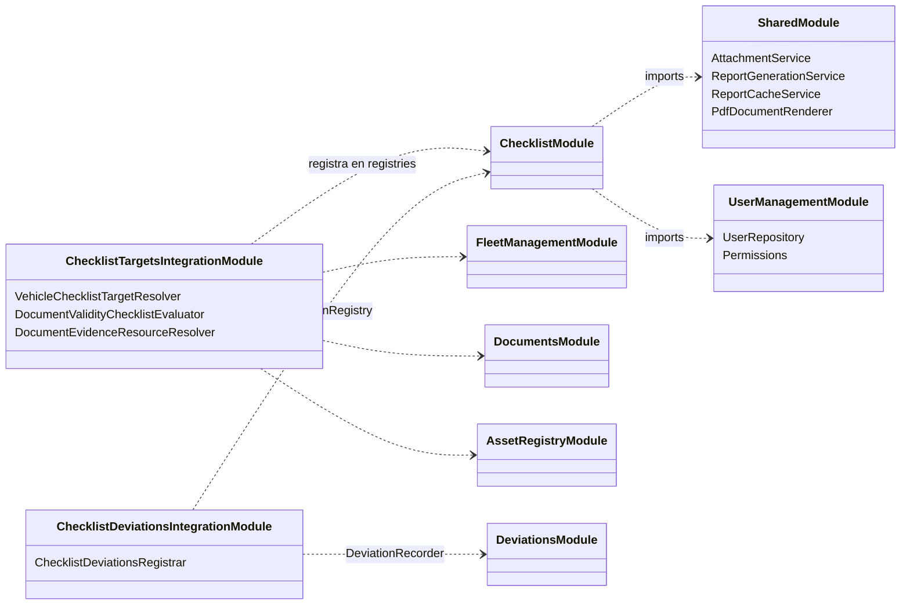
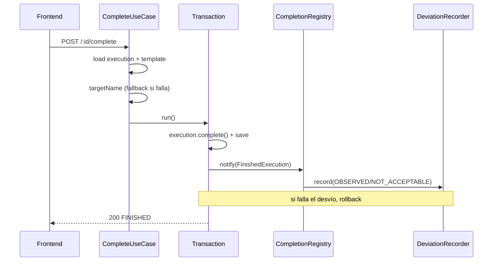

# Markdown Rendering Plugin

<referencia>
`/home/m4s1t4/Work/pp/ccp/pi-markdown-rendering/ai_docs/`
- Pi dibuja Mermaid con `grok-mermaid` en su propio markdown transformer
  (`pi-coding-agent/dist/modes/interactive/components/mermaid.js`). Si `art.width > availableWidth`,
  deja el bloque tal cual (línea 60).
- Pi aplica su transformer **antes** que los de las extensiones
  (`interactive-mode.js:1634`: `[mermaidMarkdownTransformer, ...extensionRunner.getMarkdownTransformers()]`).
  El plugin solo recibe los bloques ```` ```mermaid ```` que Pi no pudo dib
- API de extensión: `pi.registerMarkdownTransformer((markdown, ctx) => string)`, con
  `ctx = { messageType: "user" | "assistant" | "assistant-thinking", isStreaming, availableWidth }`
  (`core/extensions/types.d.ts:1112-1117, 1204`).
- `grok-mermaid` 0.2.3 (la versión que trae Pi):
  - `render(src): MermaidArt | null` → `{ plain, styled, width, warnings }`.
  - `sourceBox(src, maxWidth?)` enmarca el código fuente y lo parte para que no supere `maxWidth`.
  - `diagramKind(src)`: `'flowchart' | 'state' | 'class' | 'er' | 'sequence' | null`.
- Pi colorea las filas con `theme.fg` por clase (`border`, `text`, `edge`, `edgeLabel`, `title`) y
  convierte cada fila en un code span (`mermaid.js:5-43`). Hay que replicar ese formato para que el
  resultado se vea igual que un diagrama que Pi dibujó.
- Setting de Pi: `mermaid: "off" | "final" | "streaming"` (`core/settings-manager.d.ts:51-57`).
</referencia>

<estado_actual_en_pi>
Capturas de una respuesta real del modelo en Pi, hoy:

- Los títulos `### Modelo de dominio`, `### Conexiones con otros módulos`, `### Endpoints (25)` y `### Secuencia: iniciar ejecución` se ven en negrita con los `###` literales. En la misma respuesta, `Núcleo Conceptual` se ve en negrita sin marcas.
- Estos dos bloques quedaron como código crudo, sin dibujar y sin enmarcar:

<fixture nombre="class-lr">

</fixture>

<fixture nombre="sequence-complete">

</fixture>
</estado_actual_en_pi>

<objetivo>
Construir una extensión de Pi que haga que las respuestas del modelo se vean bien renderizadas en la terminal por sí solas, sin instruir al modelo sobre cómo escribir markdown, ni por prompt ni por `/home/m4s1t4/.pi/agent/AGENTS.md`. El alcance de v1 son dos cosas:
1. Títulos h3–h6: se ven sin las marcas `#`, con el estilo que Pi ya aplica a los títulos que dibuja.
2. Diagramas Mermaid: se ven dibujados aunque sean más anchos que la terminal. Cuando no hay forma de que entren, se ve el código fuente enmarcado y legible, nunca un bloque crudo.
</objetivo>

<reglas>
Los datos de <referencia> apuntan a líneas del código de Pi 0.99.1. Antes de escribir código, leé `ai_docs/` y verificá cada dato contra el código instalado. Si un dato no coincide o no se puede confirmar, no lo completes con el valor más plausible: documentalo como límite en el README y reportalo en Hallazgos.

Títulos:

- Verificá en el renderer de `pi-tui` cómo dibuja cada nivel de título y por qué h3–h6 quedan con `#`.
- Transformá solo los tokens de título h3–h6. Un `###` dentro de un bloque de código o de un span de código no se toca.
- Aplicá esta transformación en todos los `messageType` y también durante el streaming.

Mermaid. Para cada bloque ` ```mermaid ` que siga en el markdown:

1. Salteá el bloque si `messageType === "assistant-thinking"` o si `isStreaming` (alcance v1).
2. Salteá el bloque si tiene warnings de render: Pi ya los muestra debajo del bloque.
3. Probá estas variantes en orden y usá la primera con `art.width <= availableWidth`:
   a. `flowchart`/`graph` con dirección `LR` o `RL`: reescribí la dirección a `TD` (`BT` si era `RL`).
   b. `sequenceDiagram`: partí con `<br>` los mensajes y los nombres de participante de más de N caracteres, empezando con N = 24 y bajando hasta 12.
4. Si ninguna variante entra, reemplazá el bloque por `sourceBox(src, availableWidth)` y agregá una línea atenuada `(diagram needs W columns)` con el ancho del mejor intento.

Todo lo que no sea un título h3–h6 ni un bloque Mermaid sale igual, byte por byte.

Para cada fixture de <estado_actual_en_pi>, determiná por qué Pi no lo dibujó: ancho, `render` devolvió `null`, o warnings. Si la causa es una que estas reglas no cubren (por ejemplo `render` → `null`, o un `classDiagram` con `direction LR` que entraría con otra dirección), no inventes una regla: dejala en Pendiente de vos con la causa y tu recomendación, y seguí con el resto.
</reglas>

<diseno>
TypeScript strict, Biome, vitest, ESLint solo para el gate V(G) < 4, `.githooks/`.
- Dependencia: `grok-mermaid` fijada en 0.2.3. Pi y extensiones como dependencias de desarrollo fijadas en 0.99.1.
- Módulos:
  - `layouts.ts`: variantes de un diagrama (cambio de dirección, partido de etiquetas). Funciones puras `src → src[]`.
  - `fit.ts`: elige la primera variante que entra, o el `sourceBox`. Recibe `availableWidth` y devuelve líneas planas más clases.
  - `headings.ts`: transformación de títulos h3–h6. Función pura.
  - `transformer.ts`: recorre los tokens con `Marked` de `pi-tui`, como hace Pi, reemplaza títulos y bloques y les aplica el tema.
  - `index.ts`: registra el transformer.
</diseno>

<criterios_de_aceptacion>

- `### Modelo de dominio` se ve sin `###`, con el estilo de título de Pi.
- Un `###` dentro de un bloque de código sale idéntico.
- Un `flowchart LR` de 5 nodos que no entra en 80 columnas se ve dibujado en vertical.
- Un `sequenceDiagram` con mensajes largos entra en 100 columnas después de partir las etiquetas.
- Un diagrama imposible (8 participantes en 60 columnas) se ve como código enmarcado y nunca supera `availableWidth`.
- Los fixtures `class-lr` y `sequence-complete` a 80 columnas se ven dibujados o enmarcados, nunca como código crudo, salvo que su causa quede en Pendiente de vos según <reglas>.
- Un diagrama que Pi ya dibujó no cambia.
- El markdown sin Mermaid ni títulos h3–h6 sale idéntico.
- Con `mermaid: "off"` en los settings de Pi, el plugin no toca los bloques Mermaid. Verificá cómo leer ese setting desde una extensión; si no se puede, documentalo como límite.
  </criterios_de_aceptacion>

<verificacion>
- Un test de vitest por criterio de aceptación, con diagramas reales, comparando contra `art.width` y el markdown de salida.
- Prueba en Pi real: `pi -e ./src/index.ts` en tmux a 80 columnas, con un prompt que pida un flowchart LR grande y títulos `###`. Captura antes y después.
- Gates: `bun run typecheck`, `bun run lint`, `bun run complexity`, `bun run test`.
- Si lanzaste algo en segundo plano (Pi en tmux, un watcher), esperá su salida antes de dar el paso por cerrado.
</verificacion>

<fuera_de_alcance>

- Tablas y bloques de código anchos.
- Diagramas mientras se escribe la respuesta (`isStreaming`).
- Exportar el diagrama como imagen o abrirlo fuera de la terminal.
  </fuera_de_alcance>

<forma_de_trabajo>
Mantené la lista de tareas en `TASKS.md`: marcá cada ítem al cerrarlo y agregá lo nuevo que encuentres. Antes de la primera acción, escribí el plan en una línea.

Cuando un paso no requiere mi intervención, seguí. Las notas de estado y tus recomendaciones sobre decisiones abiertas van en el mismo mensaje que la próxima acción. No termines un mensaje sin la próxima acción en ninguno de estos casos:

1. Un resumen de lo hecho que anuncia el siguiente paso sin darlo.
2. Un ofrecimiento de seguir "salvo que prefieras otra cosa".
3. Una lista de decisiones que, según tu propio análisis, no bloquean el resto del trabajo.
4. Un corte para reportar porque el turno fue largo o cerraste un hito.

Pará y preguntá solo cuando nada pueda avanzar sin mí, o antes de algo destructivo: eliminar archivos, hacer push a GitHub o cambiar algo fuera de este repositorio.

Terminado significa: los cuatro gates pasan, cada criterio de aceptación tiene su test y pasa, y tenés las capturas antes y después. Ahí pará y pedime el visto bueno, con las capturas y la línea exacta de `~/.pi/agent/AGENTS.md:70` que vas a borrar. Con mi visto bueno, borrá esa regla de ancho.

Cerrá con tres encabezados, en este orden: Pendiente de vos, Cambios, Hallazgos.
</forma_de_trabajo>

<tarea>
Implementá la extensión descrita arriba en `/home/m4s1t4/Work/pp/ccp/pi-markdown-rendering/`.
</tarea>
